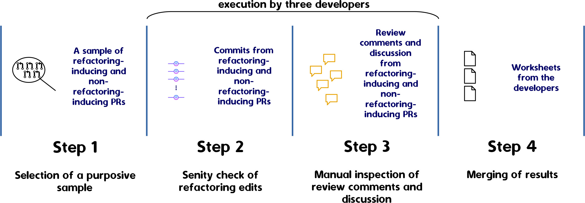

# A qualitative study on refactorings induced by code review

## Reproduction kit

Following, we provide the instructions for reproducing our qualitative study on [Apache](https://github.com/apache)'s Java repositories in line with the design and research questions below.
You can also go along the links to get access to our data and results.

*Note. This study considers the [code review and refactoring data](https://github.com/flaviacoelho/thesis-reproduction-kit/tree/master?tab=readme-ov-file#Mining-of-Refactoring-Edits-and-Code-Review-Data) previously mined from GitHub.*

---
  * [Qualitative study design](#Qualitative-study-design)
  * [Research questions](#Research-questions)
  * [Purposive sampling](#Purposive-sampling)
  * [Data analysis](#Data-analysis)
---

### Qualitative study design

### Research questions
* RQ1 How are review comments characterized in refactoring-inducing and non-refactoring-inducing pull requests? 
* RQ2 What are the differences between refactoring-inducing and non-refactoring-inducing pull requests, in terms of review comments? 
* RQ3 How do reviewers suggest refactorings in review comments in refactoring-inducing pull requests? 
* RQ4 Do suggestions of refactoring justify the reasons? 
* RQ5 What is the relationship between suggestions of refactoring and actual
refactorings in refactoring-inducing pull requests? 

### Purposive sampling

*Note. We adopted purposive sampling to select refactoring-inducing and non-refactoring-inducing PRs. We followed that sampling strategy until we reached data saturation, achieved after four rounds of analysis.*

* Run the Python script [pre-qualitative-analysis](study-two/pre-qualitative-analysis.py) for selecting a purposive data for each round of analysis

| Sample | Number of refactoring-inducing PRs | Number of non-refactoring-inducing PRs | Number of review comments | Number of subsequent commits | Number of refactoring edits |               
|:------:|:----------------------------------:|:--------------------------------------:|:-------------------------:|:-------------------------:|:------------------------------:|
| 1      | 10                                 | 10                                     | 100                       | 40                        | 66                            |
| 2      | 10                                 | 10                                     | 87                        | 20                        | 10                            |
| 3      | 13                                 | 13                                     | 327                       | 126                       | 208                           |
| 4      | 27                                 | 25                                     | 409                       | 160                       | 77                            |
|*Total* | *60*                               | *58*                                   | *923*                     | *346*                     | *361*                         |

     
  * Input was preset as *refactoring dataset* (Mining of refactoring edis and code review data, Step 2) - available in [./input](study-two/input)
  * Output: 
      * A worksheet for each round 
   
| Round | Worksheet                                                                      |                  
|:-----:|--------------------------------------------------------------------------------|
| 1     | [sample-1-spreadsheet.csv](study-two/output/sample1/sample_1_spreadsheet.csv)  | 
| 2     | [sample-2-spreadsheet.csv](study-two/output/sample2/sample_2_spreadsheet.csv)  | 
| 3     | [sample-3-spreadsheet.csv](study-two/output/sample3/sample_3_spreadsheet.csv)  | 
| 4     | [sample-4-spreadsheet.csv](study-two/output/sample4/sample_4_spreadsheet.csv)  | 

The worksheets have the following fields.
 
| Field                      | Description                                                            |
|----------------------------|------------------------------------------------------------------------|
| repo                       | Repository name                                                        |
| pr_number                  | Pull request number                                                    |
| category                   | Refactoring-inducing PR or non-refactoring-inducing PR                 |
| pr_url                     | Pull request URL                                                       |
| commit                     | Commit SHA                                                             |
| initial_flag               | If a commit is an initial or subsequent commit                         |
| refactoring_type           | Type of a refactoring edit                                             |
| refactoring_detail         | Description of a refactoring edit                                      |
| confirmed_refactoring_flag | If one refactoring is a true positive                                  |
| covered_refactoring_flag   | If a refactoring edit was induced by code review                       |
| floss_refactoring_flag     | If there is the presence of floss refactoring in a commit              |
| direct_review_comment_flag | If a review comment directly suggests a refactoring edit               |
| discussion_flag            | If there a discussion is related to a review comment in a commit       |
| rationale_flag             | If a review comment presents a rationale to suggest a refactoring edit |
| notes                      | Specific comments of a researcher                                      |
    
### Data analysis
* Subjective judgment in line with the worksheet of each round  
  * Output:
  
| Round | Merging worksheet                           | Comments from the analysts                   |
|:-----:|--------------------------------------------------------------------------------------------|---------------------------------------------------------------------------------------|
| 1     | [final-sample-1-spreadsheet.csv](study-two/output/sample1/final_sample_1_spreadsheet.csv)  | [sample-1-comments.pdf](study-two/output/sample1/sample_1_comments.pdf)  |
| 2     | [final-sample-2-spreadsheet.csv](study-two/output/sample2/final_sample_2_spreadsheet.csv)  | [sample-2-comments.pdf](study-two/output/sample2/sample_2_comments.pdf)  |
| 3     | [final-sample-3-spreadsheet.csv](study-two/output/sample3/final_sample_3_spreadsheet.csv)  | [sample-3-comments.pdf](study-two/output/sample3/sample_3_comments.pdf)  |
| 4     | [final-sample-4-spreadsheet.csv](study-two/output/sample4/final_sample_4_spreadsheet.csv)  | [sample-4-comments.pdf](study-two/output/sample4/sample_4_comments.pdf)  |

* Utils:
  * Python script ([summary-qualitative](study-two/summary_qualitative.py)) for summarizing the rounds of the qualitative analysis
